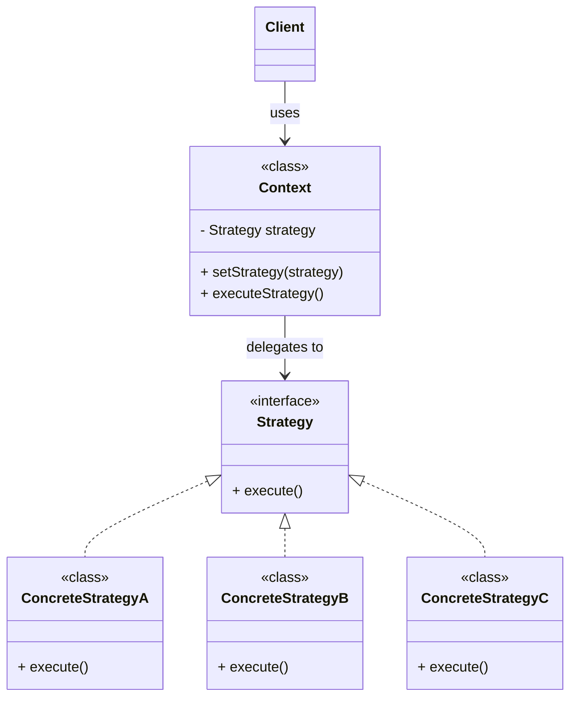
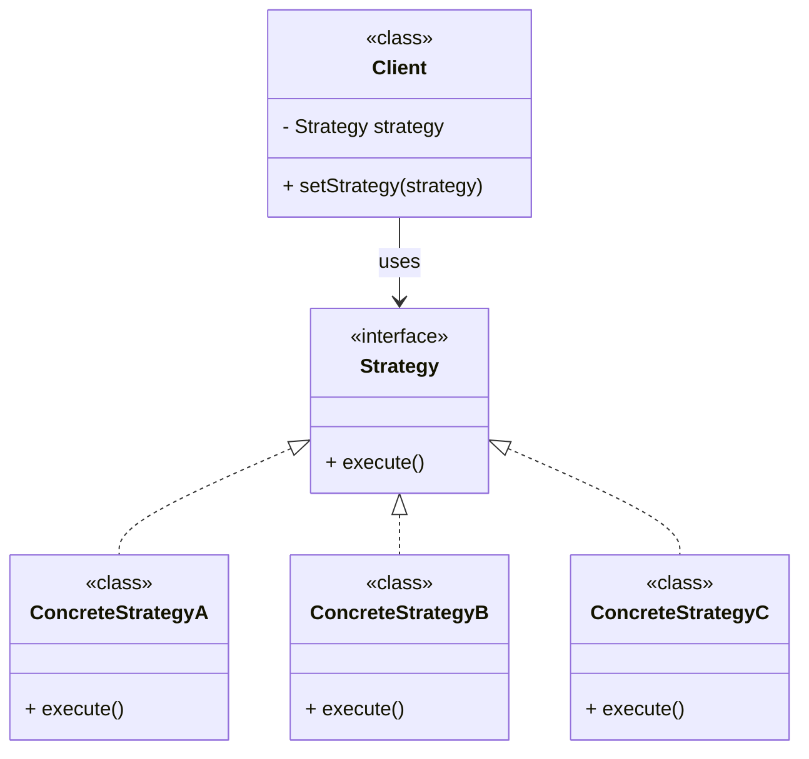
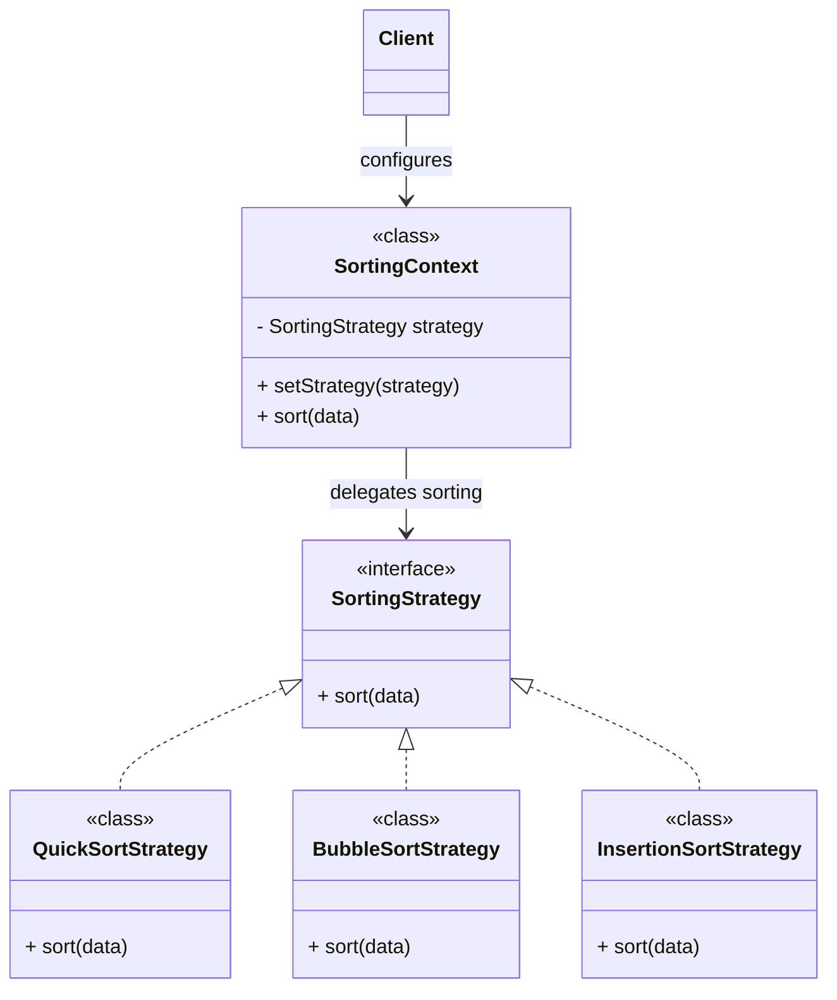

# Pattern Strategy

>**Catégorie**: Comportement | **Portée**: Objet

### Objectifs
Définir une **famille d'algorithmes**, et **encapsuler chacun** et les **rendre interchangeables** tout en assurant que chaque algorithme puisse **évoluer indépendamment** des **clients** qui l'utilisent.

>- une ***Famille d'algorithmes*** qui font **la même chose mais de manière différentes**

>- ils doivent être ***indépendant*** entre eux, fait avec l'**encapsulation i.e chaque algo (function) doit avoir sa propre classe**

>- Et pour finir, ils doivent être ***interchangeable*** (pour le **Client qui les utilise**), pour l'accomplir il doivent tous implémenter d'**une interface commune**. Si on veut **ajouter un nouvel algo** (qui fait la même mais de manière différente), on doit **obligatoirement** ajouter une nouvelle  classe qui implémente aussi l'interface commune.

>- l'**interface** commune n'a ***qu'1 seule méthode***. (en dehors ce n'est plus Strategy pattern) !! Si plusieurs methodes pour l'interface, séparer en autant d'interface commune qui ont chacune 1 seule méthode.

>- Il y a au aussi une **classe *Context* : son role est de faire** pour le ***Client***(**Main** method) **la selection de l'algo qui va être exécuté.** Elle a **l'attribut "Interface Commune".** On définit souvent **une *stratégie par default* pour la sélection (qu'on peut changer si on veut).**

>- Si **plusieurs interface commune,** la classe **Context peut avoir un attribut pour chaque type** (si c'est logique biensur)
    - **Exemple**: StrategyPayment (Paypal, Visa, Mastercard), StrategyPackageDelivery (Mondial Relay, La Poste etc)

### Architecture
#### With Context

A `Context` becomes useful when it:
- Maintains state shared across strategies.
- **Chooses strategies** dynamically.
- **Hides strategy details** from **clients**.
- **Adds behavior before/after** strategy execution (logging, metrics, validation, caching, etc.)

#### Without Context


### Raison d'utilisation
Un **objet** doit pouvoir faire **varier une partie
de son algorithme dynamiquement**.

### Résultat
Le Design Pattern permet d'isoler les
algorithmes appartenant a une même
famille d'algorithmes.

#### Exemple:

- **Client** qui veut **trier** un tableau passe par **SortingContext** ( méthode **effectuerTri** ou **performSort,** attribut **SortingStrategy**) qui appelle ensuite l'interface **SortingStrategy**:**Trier**()  (il doit avoir la possibilité de faire un triRapide, triBulle, triInsertion sont des **classe concrètes** qui implémente l'interface SortingStrategy)



SortingContext
```java
public class SortingContext {
    private SortingStrategy strategy;

    public SortingContext(SortingStrategy strategy) {
        this.strategy = strategy;
    }

    public void setStrategy(SortingStrategy strategy) {
        this.strategy = strategy;
    }

    public void sort(int[] data) {
        strategy.sort(data);
    }
}
```
Client
```java
SortingContext context = new SortingContext(new QuickSortStrategy());

context.sort(numbers);

context.setStrategy(new BubbleSortStrategy());
context.sort(numbers);
```

- methode de paiement (Paypal, Mastercard, Visa avec interface commune methode **payer**())