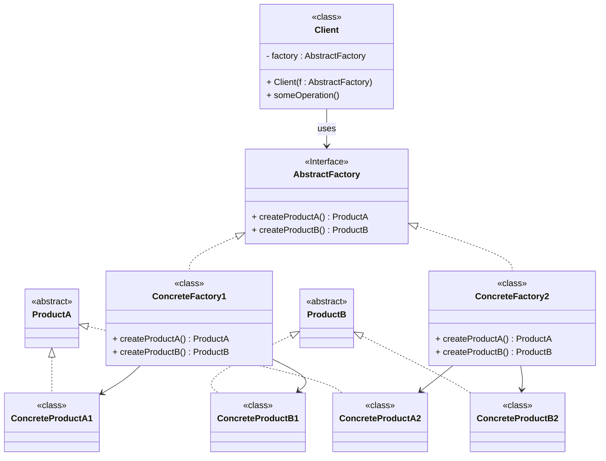

# Pattern Abstract Factory (Fabrique Abstraite)
**Catégorie**: Création | **Portée**: Classe

#### Objectif :
- Fournir une ***interface pour créer des objets d'une même famille sans préciser leurs classes concrètes***.

#### Résultat :
- Le Design Pattern permet d'isoler l'appartenance a une famille de classes.

### Structure: 



>1. **Abstract Products** declare «interfaces» for a set of distinct but related products which make up a product family.

>2. **Concrete Products** are various implementations of abstract products, grouped by variants. Each abstract product (chair/sofa) must be implemented in all given variants (Victorian/Modern).

>3. The **Abstract Factory** interface declares a set of methods for creating each of the abstract products.

>4. **Concrete Factories** implement creation methods of the abstract factory. Each concrete factory corresponds to a specific variant of products and creates only those product variants.

>5. Although concrete factories instantiate concrete products, signatures of their creation **methods must return corresponding** *abstract products*. This way the **client** code that uses a factory doesn’t get coupled to the specific variant of the product it gets from a factory. The **Client** can work with any concrete factory/product variant, as long as it communicates with their objects via abstract interfaces.

>**Nombre de concretes factories** = **nombre de variants**. (si familles ont tous même nombre de variants)
>**Nombre de methods** dans l'abstract factory = **nombre de familles**


### Example

- Imagine that you’re creating a furniture shop simulator. Your code consists of classes that represent: 
    - A family of related products, say: Chair + Sofa + CoffeeTable. 
    - Several variants of this family. For example, products Chair + Sofa + CoffeeTable are available in these variants: Modern, Victorian, ArtDeco.


>- Avec **Database et plugins JDBC** for Connection, command and transaction. Ici 3 famille d'objet  DBConnection,  DBCommand and DBTransaction (leurs variants : PostgreSQL et MySQL) 


```Mermaid
classDiagram
    %% ============================
    %%        ABSTRACT FACTORY
    %% ============================

    class DatabaseFactory {
        <<interface>>
        + DBConnection createConnection()
        + DBCommand createCommand()
        + DBTransaction createTransaction()
    }

    class MySQLFactory {
        <<class>>
        + DBConnection createConnection()
        + DBCommand createCommand()
        + DBTransaction createTransaction()
    }

    class PostgreSQLFactory {
        <<class>>
        + DBConnection createConnection()
        + DBCommand createCommand()
        + DBTransaction createTransaction()
    }

    DatabaseFactory <|-- MySQLFactory
    DatabaseFactory <|-- PostgreSQLFactory


    %% ============================
    %%        CONNECTIONS
    %% ============================

    class DBConnection {
        <<interface>>
        + open()
        + close()
    }

    class MySQLConnection {
        <<class>>
    }

    class PostgreSQLConnection {
        <<class>>
    }

    MySQLFactory --> MySQLConnection : creates
    PostgreSQLFactory --> PostgreSQLConnection : creates

    DBConnection <|.. MySQLConnection
    DBConnection <|.. PostgreSQLConnection


    %% ============================
    %%        COMMANDS
    %% ============================

    class DBCommand {
        <<interface>>
        + execute()
    }

    class MySQLCommand {
        <<class>>
    }

    class PostgreSQLCommand {
        <<class>>
    }

    MySQLFactory --> MySQLCommand : creates
    PostgreSQLFactory --> PostgreSQLCommand : creates

    DBCommand <|.. MySQLCommand
    DBCommand <|.. PostgreSQLCommand


    %% ============================
    %%        TRANSACTIONS
    %% ============================

    class DBTransaction {
        <<interface>>
        + commit()
        + rollback()
    }

    class MySQLTransaction {
        <<class>>
    }

    class PostgreSQLTransaction {
        <<class>>
    }

    MySQLFactory --> MySQLTransaction : creates
    PostgreSQLFactory --> PostgreSQLTransaction : creates

    DBTransaction <|.. MySQLTransaction
    DBTransaction <|.. PostgreSQLTransaction

```

```java
public class Client {

    public static void main(String[] args) {

        // 1. Choose the factory (plugin)
        DatabaseFactory factory = new MySQLFactory();

        // 2. Create objects via factory (no concrete classes in client logic)
        DBConnection connection = factory.createConnection();
        DBCommand command = factory.createCommand();
        DBTransaction transaction = factory.createTransaction();

        // 3. Use the objects
        connection.open();

        transaction.begin();

        command.execute("SELECT * FROM users");

        transaction.commit();

        connection.close();
    }
}
```
