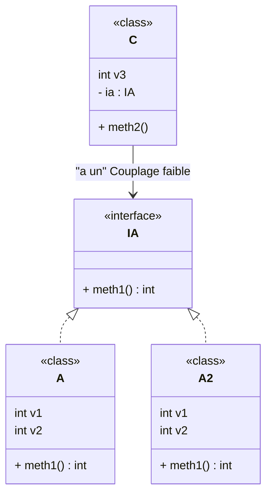
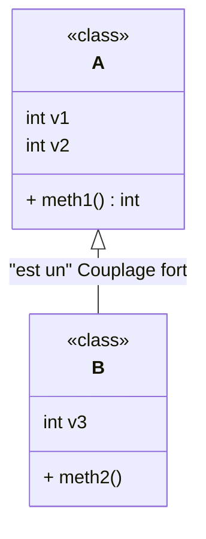

# Design Pattern

    Design Pattern/
    ├── Patterns architectures/
    │   ├── Microservices
    │   ├── CQRS
    │   ├── Event Sourcing
    │   ├── Circuit Breaker
    │   └── MVC
    └── Patterns tactiques/
        ├── Creational/
        │   ├── ⭐Abstract Factory✅
        │   ├── 📌Factory Method ✅
        │   ├── Builder ✅
        │   ├── Prototype
        │   └── ⭐Singleton ✅
        ├── Structural/
        │   ├── Adapter (objet) ✅
        │   ├── 📌Decorator ✅
        │   ├── ⭐Proxy
        │   ├── Bridge
        │   ├── Facade
        │   ├── Composite
        │   └── Flyweight
        └── Behavioral/
            ├── 📌Strategy ✅
            ├── ⭐Observer ✅
            ├── 📌Chain of Responsibility
            ├── Template Method
            ├── Iterator
            ├── Mediator
            ├── Visitor
            ├── State
            ├── Command
            ├── Interpreter
            └── Memento

### Classification des Design Patterns
2 familles
* Patterns ***tactiques*** (Strategy, Observer ...)
* Patterns ***architectures*** (Ex: MVC { dérivés: MVP, MVVM}, CQRS, Event Sourcing, Circuit breaker) : il est composé d'un ensemble de pattern tactiques

## Patterns tactiques
3 catégories:

>#### **Creation**

- Description de ***la manière dont un objet ou un ensemble d'objets peuvent être créés, initialisés, et configurés***

- Isolation du code relatif à la création, à l'initialisation afin de rendre l'application indépendante de ces aspects

- Exemples : `Abstract Factory`, `Factory Method`, `Builder`, `Prototype`, `Singleton`

>#### **Structure:** diagramme qui montre la **connexion entre les classes**

- Description de ***la manière dont des objets de l'application doivent etre connectés*** afin de rendre ces connections indépendantes des évolutions futures de l'application

- Exemples : `Adapter(objet)`, `Composite`, `Bridge`, `Decorator`, `Facade`, `Proxy`

>#### **Comportement:** diagramme de **sequence, objets**

- Description de ***comportements d'interaction entre objets***
- Gestion des **interactions dynamiques entre des classes et des objets**

- Exemples : `Strategy`, `Observer`, `Iterator`, `Mediator`, `Visitor`, `State`


### **Portée** des design patterns

2 types:

>#### Portée de classe

- Focalisation sur les relations entre les classes et leurs sous-classes

- Réutilisation par Héritage

>#### Portée d'instance (Objet)

- Focalisation sur les relations entre les objets

- Réutilisation par Composition (association)


### **Héritage** et **Composition**
Dans la ***programmation orientée objet***, l'héritage
et la composition sont **2 moyens** qui permettent la **reutilisation des classes**.

>#### Composition
```java
public class A {
    int v1 = 2;
    int v2 = 3;

    public void meth1() {
        System.out.print(v1 + v2);
    }
}

public class C {
    int v3 = 5;
    A a = new A(); //Composition

    void meth2() {
        System.out.print(a.meth1() * v3);
    }
}
```

- La composition traduit le terme ***« A un »*** ou
***« A plusieurs »***.

- Couplage ***faible*** si la classe a un attribut (interface) qui est une ***interface*** : class C -> Interface A -> Class A ou B etc



- et couplage **fort** si la classe a un attribut (classe) qui est une **classe** concrète (**à éviter**) : class C -> Class A

>#### Heritage
```java
public class B extends A {
    int v3 = 5;

    void meth2() {
        System.out.print(super.meth1() * v3);
    }
}
```
- L'héritage traduit le terme ***« Est un »*** ou ***« Une
sorte de »***

- Par défaut couplage **fort** : B extends A donc on a class B -> class A



## Design Pattern List


