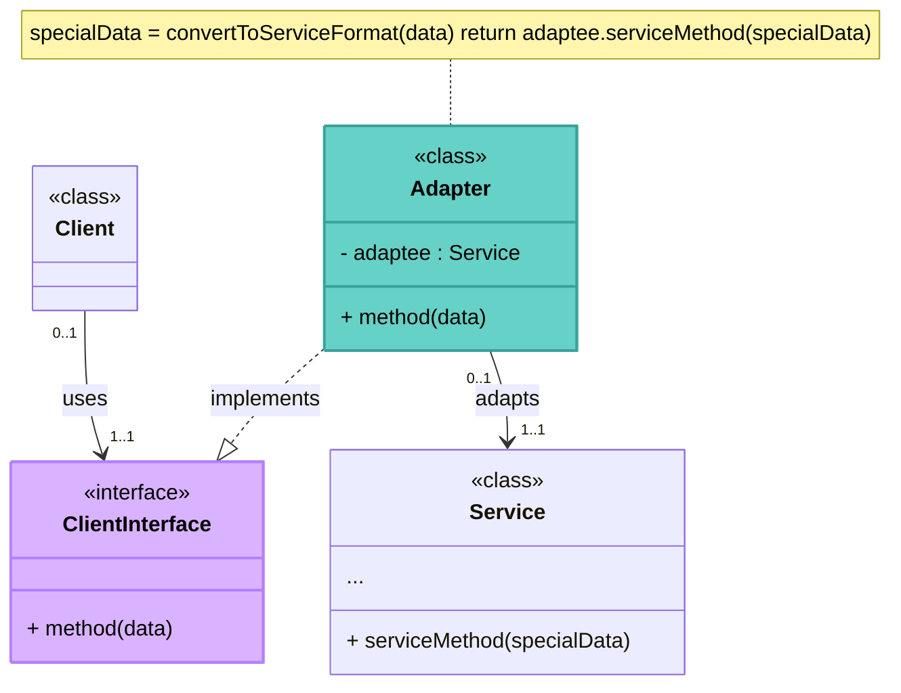
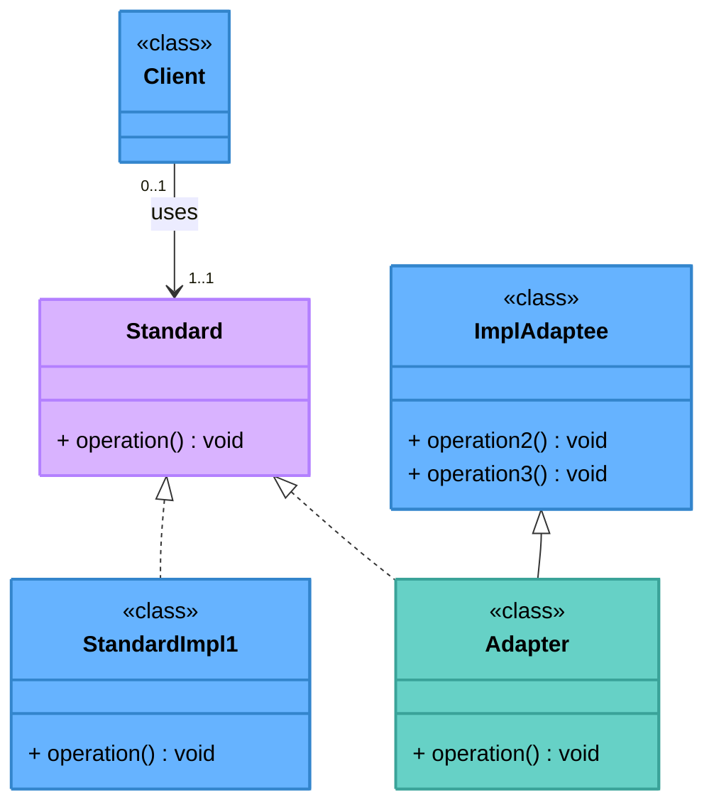

# Pattern Adapter
**Catégorie**: Structure | **Portée**: Objet ou Classe

#### Intention 
- allows objects with incompatible interfaces to collaborate

#### Objectif

>- ***Convertir l'interface*** d'une classe ***en une autre interface*** **comprise** par la ***partie cliente***.
- Permettre à des classes de fonctionner ensemble, ce qui n'aurait pas été possible à cause de leurs interfaces **incompatibles**.

#### Résultat
 - Le Design Pattern **permet d'isoler l'adaptation** d'un sous-système.

### Structure

#### Adapter par **Composition**
(plus facile à faire) l'adapter possède un attribut de type Service



>1. The **Client** (manipule des objets Standard ou n'accepte qu'un Standard, Ex: un Screen Monitor qui n'accepte que du VGA et pas HDMI) is a **class** that contains the existing business logic of the program. (on va faire appel au code de la class incompatible **Service** en passant par **ClientInterface** puis **Adapter** !! sans modifier le code du Client)

2. The **Client Interface** (source ou Standard) describes a protocol that other classes must follow to be able to collaborate with the client code.

3. The **Service** (destination ou Apdatee) is some useful **class** (usually 3rd-party or legacy). The client can’t use this class directly because it has an **incompatible** interface.

>4. The **Adapter** (middle man ou adaptateur) is a **class** that’s **able to work with both the** *client* and the *service*: it *implements the client interface*, while *wrapping the service object*. The ***adapter*** receives **calls from the** *client* **via the** *client interface* and translates them into calls to the wrapped service object in a format it can understand.

5. The client code doesn’t get coupled to the concrete adapter class as long as it works with the adapter via the client interface. Thanks to this, you **can introduce new types of adapters into the program without breaking the existing client code**. This can be useful when the interface of the service class gets changed or replaced: you can just create a new adapter class without changing the client code.

#### Adapter par **Héritage**
L'adapter hérite du Service, 🚨 **marche pas si ClientInterface (Standard) est une "class"** car héritage multiple interdit en Java.



### Exemple


```Mermaid
classDiagram
    %% ============================
    %%        TARGET INTERFACE
    %% ============================

    class Target {
        <<interface>>
        + request()
    }

    %% ============================
    %%        CLIENT
    %% ============================

    class Client {
        - Target target
        + Client(Target target)
        + doWork()
    }

    Client --> Target : uses


    %% ============================
    %%        ADAPTER
    %% ============================

    class Adapter {
        <<class>>
        - Adaptee adaptee
        + request()
    }

    Target <|.. Adapter
    Adapter --> Adaptee : calls


    %% ============================
    %%        ADAPTEE
    %% ============================

    class Adaptee {
        <<class>>
        + specificRequest()
    }

```

```Java
class Client {
    private Target target; // composition/reference to Target

    public Client(Target target) {
        this.target = target;
    }

    public void dowork() {
        target.request();
    }
}
```

Here:
- `Client` depends only on `Target`
- `Adapter` implements `Target`
- The actual object injected may be:
    - an `Adapter`or
    - another implementation of `Target`

```Java
class Adapter implements Target {
    private Adaptee adaptee; // composition/reference to Adaptee

    public Client(Adaptee adaptee) {
        this.adaptee = adaptee;
    }

    public void request() {
        adaptee.specificRequest();
    }
}
```

Le système doit intégrer un sous-système existant.
- Ce sous-système a une interface non standard par rapport au système.
- Cela peut être le cas d'un driver bas niveau pour de l'informatique
embarquée.
- Le driver fournit par le fabricant ne correspond pas à l'interface utilisée par le système pour d'autres drivers.
- La solution est de masquer cette interface non stantard au système et de lui
presenter une interface standard.
- La partie cliente utilise les méthodes de l'Adaptateur qui utilise les méthodes du sous-système pour réaliser les opérations correspondantes.