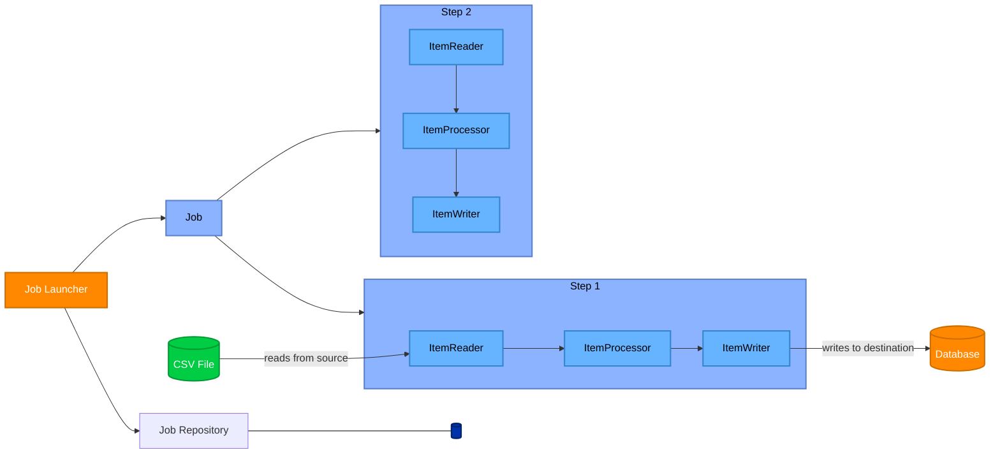

# Spring Batch
Youtube *JavaTechie* : Spring Batch for Beginners 

**Table of Content**
- 💡Architecture
- Dans la classe de Config
  - Job
  - Step
  - Chunk Processing
  - ItemReader«T»
  - ItemProcessor<I, O>
  - ItemWriter«T»
- Debug
- Exemple
- Real Production Improvements
- 💡Relation entre **Spring Batch** et **Hibernate JDBC Batch**

## Architecture



### Mental model
| Concept     | Typical Usage              |
|-------------|-----------------------------|
| `Job`         | Entire batch workflow       |
| `Step`        | One business phase          |
| `Reader`      | Input                       |
| `Processor`   | Business logic              |
| `Writer`      | Output                      |


### Dans le Controller
**Job launcher**:

est chargé d'exécuté les **Job**, en paralèlle, il fait appel aussi au **Job Repository**.

### Dans la classe de Config
```java
@EnableBatchProcessing
```
- **Spring Boot 3+** usually unnecessary, juste *@Configuration* suffit
- Older Spring / custom setup still used

On a déclaré en @**Bean**
## Job
A **Job** is the complete batch process.

In real enterprise applications, teams often do: **One Config** file per **Job**.
- **CustomerImport**JobConfig
- **InvoiceExport**JobConfig
- **Cleanup**JobConfig

Example:
- Importing a **Csv** file into a database
- Processing daily bank transactions

A Job contains one or more **Steps**.

Spring (Since **Batch 5+ version**) to create **Job** recommends directly using **JobBuilder** with 
- JobRepository
- PlatformTransactionManager

```java
new JobBuilder("job", jobRepository)
```

## Step
A **Step** is one phase of the job.

Example:
- Step 1 → Read file (Reader)
- Step 2 → Validate data (Processor)
- Step 3 → Save into DB (Writer)

Most common type:

**Chunk-oriented Step**

**Spring** (Since **Batch 5+ version**) to create **Step** recommends directly using **StepBuilder** with
- JobRepository
- PlatformTransactionManager

```java
new StepBuilder("step1", jobRepository)
```
Un **Step** peut avoir plusieurs reader, processor ou writer ce n'est pas limité à 1 pour chaque.

En général, chaque **Step** a 3 phases (objets): 
- un `ItemReader` (only one),
- un `ItemProcessor` (multiple is possible via `CompositeItemProcessor`)
- et un `ItemWriter` (multiple is possible via `CompositeItemWriter`)

### Chunk Processing

Spring Batch ***usually works with chunks***.

Example:
>- Read 100 records
>- Process 100 records
>- Write 100 records
>- Commit transaction

Then repeat.

This improves:
- performance
- memory usage
- transaction handling

### ItemReader«T» :
#### Purpose

Reads data from a source.
>Think: “Where does the data come from?”

Examples:
- CSV file
- Database
- JSON/XML
- Kafka
- REST API

#### Flow
<pre>File/DB/API --> ItemReader --> Java Object
</pre>

#### Common Reader implementations
| Implementation          | Reads From                 | Easy?       | Common?        |
|-------------------------|-----------------------------|-------------|----------------|
| `FlatFileItemReader`      | CSV / Text file             | ⭐Very easy   | ⭐⭐⭐ Most common |
| `JdbcCursorItemReader`    | Database                    | Medium      | ⭐⭐⭐           |
| `JdbcPagingItemReader`    | Database (with pagination)  | Medium      | ⭐⭐            |
| `JsonItemReader`          | JSON file                   | Easy        | ⭐              |
| `StaxEventItemReader`     | XML                         | Harder      | ⭐              |
| `RepositoryItemReader`    | Spring Data repository      | Easy        | ⭐⭐            |


### ItemProcessor<I, O>
#### Purpose

Transforms or validates data.
> A cette étape, on peut ne rien faire (aucne transformation) sur les objets reçus du Reader si on veut, avant de les passer au Writer. 

> Think: “What should happen to the data?”

Examples:
- convert names to uppercase
- calculate totals
- filter invalid records
- map DTO → Entity

#### Flow
<pre>Input Object (`Dto` ou `Record`) --> ItemProcessor --> Modified Object
</pre>

#### Important Detail
If processor returns:
>- **object** → item continues
>- *null* → item is filtered/skipped

#### Common Processor implementations
Usually developers create their own implementation:
```java
implements ItemProcessor<I, O>
```

Spring also provides:
| Implementation              | Purpose                     |
|-----------------------------|-----------------------------|
| `ValidatingItemProcessor`     | Validation                  |
| `CompositeItemProcessor`      | Chain multiple processors   |
| `PassThroughItemProcessor`    | No transformation           |

##### Most Common / Easiest
Custom processor

Example
```java
public class UserProcessor implements ItemProcessor<User, User> {
    @Override
    public User process(User user) {
        user.setName(user.getName().toUpperCase());
        return user;
    }
}
```

### ItemWriter«T»

**Purpose**

Writes data somewhere.

>Think: “Where does the processed data go?”

Examples:
- database
- file
- API
- Kafka

#### Flow
<pre>Processed Objects --> ItemWriter --> DB/File/API
</pre>

#### Common Writer implementations

| Implementation          | Writes To                 | Easy? | Common?                |
|-------------------------|---------------------------|--------|-------------------------|
| `JdbcBatchItemWriter`     | Database                  | ⭐⭐     | ⭐⭐⭐ Most common        |
| `FlatFileItemWriter`      | CSV / Text file           | ⭐⭐     | ⭐⭐⭐                    |
| `JsonFileItemWriter`      | JSON file                 | ⭐      | ⭐                     |
| `RepositoryItemWriter`    | Spring Data repository    | ⭐⭐     | ⭐⭐                     |
| `CompositeItemWriter`     | Multiple writers          | Medium | ⭐                      |

Example
<pre>
CSV File
    ↓
FlatFileItemReader
    ↓
ItemProcessor
(validate/transform)
    ↓
JdbcBatchItemWriter
    ↓
Database
</pre>

Pour écrire dans la **BDD**:
- `JpaItemWriter`
    - writes directly using JPA (uses JPA/Hibernate entities)
    - Slower for huge volumes
    - Less optimized than JDBC batch
    - More object-oriented
    - Higher-level
- `JdbcBatchItemWriter`
    - uses SQL queries
    - plus performant
    - more memory efficient
    - Lower-level
- `RepositoryItemWriter`
    - Uses Spring Data repository (Mandatory @Repository)
    - speed : fine (less than JpaItemWriter)


## Exécution
- Par **default** (most common), le batch processing est exécuté de manière ***synchrone ou sequentiel*** (des chunks de données). Donc ici les entité crée dans la BDD appraîtront par ID croissant.

- Dans le cas d'une **exécution concurentiel** (des chunks de données) (***asynchrone***) pour **augmenter plus encore performance d'execution**. 
    - Ajouter `TaskExecutor` au `StepBuilder`
    - `Reader` must be thread-safe (très peu le sont)
    - `Writer` must be thread-safe
    - **Incovénients**: Ordre insertion pas garanti

- les `Steps` d'un `Job` sont exécutés **par defaut** en **sequentiel**, on peut aussi les executer en **parallèle** (**concurentielles**) avec *split() + TaskExecutor*

### Debug:
Le Spring Batch processing, créer des tables supplémentaires dans la BDD qui servent à monitor, debug les jobs executés par le Batch Processing.

### Exemple:
So When Do We Use Multiple Steps?

Multiple steps are used when phases are truly independent.

>Example 1:
- Step 1 -> Download file from SFTP: download file
- Step 2 -> Process CSV: CSV -> DB (Reader, Processor, Writer)
- Step 3 -> Generate report: Generate summary
- Step 4 -> Send email: Notify users

>Example 2

On veut Importer des clients (leur informations) d'un fichier **.csv** pour les sauvegarder dans la BDD en utilisant le ***Batch processing***.

**Flow**:
<pre> “CSV → Process → Database”
</pre>

- resources/customers.**csv** (Exemple de localisation, dans la réalité on fournit le fichier depuis le endpoint)
<pre>
id,firstName,lastName,email
1,John,Doe,john@gmail.com
2,Jane,Smith,jane@gmail.com
3,Alex,Brown,alex@gmail.com
</pre>

- domain/**entity**/**Customer**.java (Database Table)
```java
package com.example.batch.entity;

import jakarta.persistence.Entity;
import jakarta.persistence.Id;
import lombok.Data;

@Entity
@Data
public class Customer {

    @Id
    private Long id;

    private String firstName;

    private String lastName;

    private String email;
}
```

- domain/**dto**/**CustomerCsv**.java (Used by Reader, represents Raw csv data)
```java
package com.example.batch.dto;

import lombok.Data;

@Data
public class CustomerCsv {

    private Long id;

    private String firstName;

    private String lastName;

    private String email;
}
```

- config/**CustomerBatchConfig**.java
```java
@Configuration
@RequiredArgsConstructor
public class CustomerBatchConfig {

    private final JobRepository jobRepository;

    private final PlatformTransactionManager transactionManager;

    private final EntityManagerFactory entityManagerFactory;

    /*
     * ******************************
     * ITEM READER
     * ******************************
     */
    @Bean
    public FlatFileItemReader<CustomerCsv> customerReader() {

        return new FlatFileItemReaderBuilder<CustomerCsv>()
                .name("customerReader")
                .resource(new ClassPathResource("customers.csv"))
                .delimited()
                .names("id", "firstName", "lastName", "email")
                .targetType(CustomerCsv.class)
                .linesToSkip(1)
                .build();
    }

    /*
     * ******************************
     * ITEM PROCESSOR
     * ******************************
     */
    @Bean
    public ItemProcessor<CustomerCsv, Customer> customerProcessor() {

        return item -> {

            Customer customer = new Customer();

            customer.setId(item.getId());
            customer.setFirstName(capitalize(item.getFirstName()));
            customer.setLastName(capitalize(item.getLastName()));
            customer.setEmail(item.getEmail().toLowerCase());

            return customer;
        };
    }

    /*
     * ******************************
     * ITEM WRITER
     * ******************************
     */
    @Bean
    public JpaItemWriter<Customer> customerWriter() {

        return new JpaItemWriterBuilder<Customer>()
                .entityManagerFactory(entityManagerFactory)
                .build();
    }

    /*
     * ================================
     * STEP
     * ================================
     */
    @Bean
    public Step customerStep() {

        return new StepBuilder("customerStep", jobRepository)
            .<CustomerCsv, Customer>chunk(10, transactionManager)
            .reader(customerReader())
            .processor(customerProcessor())
            .writer(customerWriter())
            .build();
    }

    /*
     * ================================
     * JOB
     * ================================
     */
    @Bean
    public Job customerJob() {

        return new JobBuilder("customerJob", jobRepository)
            .start(customerStep())
            .build();
    }

    private String capitalize(String value) {

        return value.substring(0, 1).toUpperCase()
            + value.substring(1).toLowerCase();
    }
}
```

- controller/**JobController**

```java
import org.springframework.batch.core.Job;
import org.springframework.batch.core.JobParameters;
import org.springframework.batch.core.JobParametersBuilder;
import org.springframework.batch.core.launch.JobLauncher;
import org.springframework.web.bind.annotation.GetMapping;
import org.springframework.web.bind.annotation.RestController;

@RestController
@RequiredArgsConstructor
public class CustomerBatchController {

    private final JobLauncher jobLauncher;

    private final Job customerJob;

    @GetMapping("/batch/start")
    public String startBatch() {

        try {

            JobParameters jobParameters =
                new JobParametersBuilder()
                    .addLong("startAt", System.currentTimeMillis())
                    .toJobParameters();

            jobLauncher.run(customerJob, jobParameters);

            return "Batch job started successfully";

        } catch (Exception e) {

            return "Batch job failed: " + e.getMessage();
        }
    }
}
```
- repository/**CustomerRepository** (**facultatif** à cause de **JpaItemWriter** qui n'a pas besoin de Sprind Data Repository)

### Real Production Improvements
Usually you would also add:
- Validation
- Skip invalid rows
- Retry mechanism
- Logging (Ex: invalid rows with SkipListener<CustomerDto, Customer> on Step.Skip with Step.listener)
- Parallel processing
- Job listeners
- Dynamic CSV upload
- Multi-step jobs
- Restartability

## Relation entre Spring Batch et Hibernate JDBC Batch
1. ***Spring Batch*** **chunk(size)**

Example:
```java
.stepBuilderFactory.get("step")
    .<User, User>chunk(100)
```

👉 This means:

>Process 100 items per transaction

Flow:
<pre>
READ 100 items
PROCESS 100 items
WRITE 100 items
COMMIT transaction 
</pre>

After commit:
- persistence context cleared
- next chunk starts
2. ***Hibernate*** **jdbc.batch_size**

Example:

hibernate.**jdbc.batch_size=20**

👉 This means:

>Hibernate groups SQL statements in batches of 20

inside the transaction.

#### Combined Example
Suppose:
Spring Batch
<pre>
chunk(100)
</pre>

Hibernate

<pre>
hibernate.jdbc.batch_size=20
</pre>

Writing 100 entities
```java
for each item:
    entityManager.persist(user)
```

What Actually Happens

💡**Spring Batch** opens:
<pre>
ONE transaction for 100 items
</pre>
💡Inside that transaction, **Hibernate** sends INSERTs in groups of 20.

Database Requests
<pre>
Batch Request 1 -> inserts 1-20
Batch Request 2 -> inserts 21-40
Batch Request 3 -> inserts 41-60
Batch Request 4 -> inserts 61-80
Batch Request 5 -> inserts 81-100
</pre>
Then:

COMMIT

#### Important Difference

"chunk(100)" 
>controls: **Transaction boundary**

"batch_size=20"

>controls: SQL grouping inside transaction

Visual Flow
<pre>
Chunk transaction (100 items)
│
├── JDBC batch 1 (20 inserts)
├── JDBC batch 2 (20 inserts)
├── JDBC batch 3 (20 inserts)
├── JDBC batch 4 (20 inserts)
└── JDBC batch 5 (20 inserts)

COMMIT
</pre>

donc 
<pre>
- chunk(100) -> 100 items processed in one transaction

- Hibernate creates (with hibernate.jdbc.batch_size=20):

100/20 = 5 JDBC batches, it means it will communicate with DB 5 times

-if **hibernate.jdbc.batch_size is 0 ** (disbaled) then we will 1 communication with DB per 1 request (!!🚩which is very bad for performance for large datasets)

JDBC batches.
</pre>


